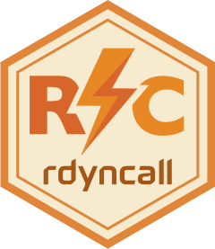
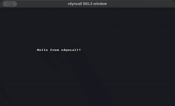
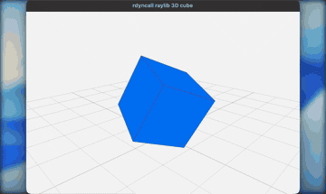

```{r setup, include=FALSE}
library(rdyncall)
```

# rdyncall 

<!-- badges: start -->
[](https://github.com/hongyuanjia/rdyncall/actions/workflows/R-CMD-check.yaml)
<!-- badges: end -->

`rdyncall` provides an R interface to the [DynCall](https://dyncall.org)
libraries. It is a low-level Foreign Function Interface (FFI) for loading
shared C libraries, resolving symbols, calling C functions from R by signature,
working with C `struct` and `union` data, and exposing R functions as C callback
pointers.

The package is intended for developers who already know the C API they want to
call and need an exploratory or dynamic binding layer from R without writing a
compiled wrapper for every function.

## Showcase

`rdyncall` can call into native libraries directly from R: generate an SDL3
binding package from DynPort metadata, open a real SDL3 window, or bind raylib
drawing calls and drive a rotating 3D scene.

<table>
<tr>
<th width="50%" align="left">SDL3 generated binding package</th>
<th width="50%" align="left">raylib 3D rendering from R</th>
</tr>
<tr>
<td width="50%" valign="top">

</td>
<td width="50%" valign="top">

</td>
</tr>
<tr>
<td width="50%" valign="top">

</td>
<td width="50%" valign="top">

</td>
</tr>
</table>

## Installation

```r
remotes::install_github("hongyuanjia/rdyncall")
```

`rdyncall` was previously archived on CRAN. This repository contains the active
modernization work toward a maintainable package and current R toolchains.

## Quick Start

Generated DynPort packages can be called through ordinary package namespaces:

```{r}
dynport(SDL3, package = "SDL3")
SDL3::SDL_GetPlatform()
```

You can also call a C function directly by loading a library, resolving a
symbol, and providing a call signature:

```r
library(rdyncall)

mathlib <- dynfind(c("msvcrt", "m", "m.so.6"))
sqrt_addr <- dynsym(mathlib, "sqrt")

dyncall(sqrt_addr, "d)d", 144)
```

The signature `"d)d"` means one C `double` argument and a C `double` return
value. Signatures must match the target C function type.

R functions can also be wrapped as C callback pointers:

```r
add <- ccallback("ii)i", function(x, y) x + y)
dyncall(add, "ii)i", 20L, 3L)
```

Foreign aggregate layouts are described once and then used through raw-backed
objects:

```{r}
cstruct("Rect{ssSS}x y w h;")

rect <- cdata(Rect)
rect$x <- 40
rect$y <- 60
rect$w <- 10
rect$h <- 15

rect$w * rect$h
```

## Learn rdyncall

The pkgdown articles are the main documentation path:

- Start with [Getting started](https://hongyuanjia.github.io/rdyncall/articles/rdyncall.html)
  and [Signatures for C calls](https://hongyuanjia.github.io/rdyncall/articles/signatures.html).
- Continue with [Structs, unions, and memory](https://hongyuanjia.github.io/rdyncall/articles/structs-unions-memory.html)
  and [Callbacks from C to R](https://hongyuanjia.github.io/rdyncall/articles/callbacks.html).
- Build larger bindings with [dynbind and DynPort bindings](https://hongyuanjia.github.io/rdyncall/articles/dynbind-dynport.html),
  [Creating DynPort files](https://hongyuanjia.github.io/rdyncall/articles/creating-dynports.html),
  and the [demo articles](https://hongyuanjia.github.io/rdyncall/articles/non-gui-demos.html).
- Use [Troubleshooting](https://hongyuanjia.github.io/rdyncall/articles/troubleshooting.html)
  and [FFI safety boundaries](https://hongyuanjia.github.io/rdyncall/articles/ffi-safety.html)
  before binding ownership-sensitive, callback-heavy, or platform-specific APIs.

## API Map

- `dynload()`, `dynunload()`, `dynsym()`, `dynpath()`, `dyncount()` and
  `dynlist()` load shared libraries and inspect symbols.
- `dynfind()` resolves common short library names across platforms and package
  manager locations.
- `dyncall()` and `dyncall_variadic()` call C functions using compact type
  signatures.
- `dynbind()` creates thin R wrappers for a group of C functions.
- `cstruct()`, `cunion()`, `cdata()` and `as.ctype()` describe and access C
  aggregate data.
- `pack()` and `unpack()` read and write low-level C values in raw vectors or
  memory referenced by external pointers.
- `ccallback()` turns an R function into a C function pointer.
- `dynport()` builds and loads generated R packages from DCF `.dynport`
  binding specifications.

## Structs, Unions and Memory

`rdyncall` can model ordinary C `struct` and `union` layouts and supports
several layout features needed by real C APIs:

- fixed-size array fields, written as `type[N]`, such as `C[4]`;
- integer bitfields, written in the field-name list, such as `flags:3`;
- packed and aligned layouts via `@packed`, `@pack(n)` and `@align(n)`;
- nested aggregate fields and by-value aggregate calls on supported DynCall
  backends.

For callbacks, `ccallback()` supports aggregate by-value arguments and returns
on the implemented x86_64 and ARM64 dyncallback backends.

## DynPort Bindings

`dynport()` is the package-level mechanism for binding a C API from a data file.
The current implementation supports DCF `.dynport` files and generates ordinary
on-disk R packages whose namespace is populated from the DynPort metadata.

The package ships one maintained DynPort example, `inst/dynports/SDL3.dynport`,
generated from SDL3 headers with
[`porter`](https://github.com/hongyuanjia/porter). See the generated-binding
articles for how to create DynPort metadata for a C library, load it with
`dynport()`, and run a non-GUI SDL3 smoke test.

## Demos

<video controls muted loop playsinline width="360" poster="https://github.com/hongyuanjia/rdyncall/releases/download/docs-media/rdyncall-sdl3-snake-poster.png"><source src="https://github.com/hongyuanjia/rdyncall/releases/download/docs-media/rdyncall-sdl3-snake.mp4" type="video/mp4"></video>

Run `demo(package = "rdyncall")` to list installed demos. The package includes
small examples for direct FFI calls, callbacks, `qsort`, `stdio`, GLPK,
libxml2, SDL3 and raylib.

Some demos require system shared libraries or open GUI windows. For
non-interactive environments, see the Non-GUI demos article.

See the [Non-GUI demos](https://hongyuanjia.github.io/rdyncall/articles/non-gui-demos.html)
article for XML parsing, C sorting, GLPK optimization, and stdio examples. The
[GUI demos](https://hongyuanjia.github.io/rdyncall/articles/gui-demos.html)
article shows SDL3 and raylib examples with release-hosted media clips.

## Safety

This is a low-level FFI. A wrong function address, call signature, calling
convention, pointer lifetime or struct layout can crash the R process. Keep the
C declaration beside the R signature when writing bindings, and hold an R
reference to callback objects for as long as foreign code may call them.
Read the [FFI safety boundaries](https://hongyuanjia.github.io/rdyncall/articles/ffi-safety.html)
article before binding APIs that allocate memory, store pointers, register
callbacks, or run event loops.

## Project Status

This repository is the active maintenance branch for modern R. Recent work has
restored compilation on current toolchains, refreshed the bundled DynCall
source, modernized CI, added variadic calls, improved dynamic library discovery,
and expanded aggregate layout support.

## Acknowledgements

`rdyncall` builds on the [DynCall](https://dyncall.org) project. The DynCall
libraries make portable dynamic calls, callback bridges, and low-level library
loading possible across platforms.

This package was originally created by Daniel Adler. The current repository
continues that work for modern R toolchains and expands the package with updated
documentation, demos, and binding workflows.

The optional [Rtinycc](https://github.com/sounkou-bioinfo/Rtinycc) package by
Sounkou Mahamane Toure is also a strong companion for `rdyncall`. It makes it
possible to compile small C kernels at runtime from R, while `rdyncall` can bind
the surrounding native libraries and call through function pointers.

## References

- Adler, D. (2012). "Foreign Library Interface". *The R Journal*, 4(1),
  30-40. <https://journal.r-project.org/articles/RJ-2012-004/>
- DynCall Project: <https://dyncall.org>
